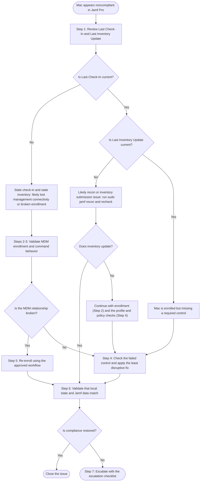

# Troubleshooting Compliance Failures on Jamf-Managed Macs

This article describes how to diagnose and remediate a Jamf-managed Mac that appears noncompliant in Jamf Pro or in a downstream compliance workflow. Use it to determine whether the issue is caused by stale inventory, broken MDM enrollment, failed policy execution, missing configuration, or an actual device-state problem.

> ℹ️ **Scope:** This article is written for a classic Jamf Pro workflow built on MDM commands, configuration profiles, policies, and inventory. If your environment also uses Blueprints (declarative device management) or Jamf Compliance Benchmarks, device state may be reported differently. Adapt the checks to match how your environment reports compliance.

## Audience

- macOS device management engineers
- Desktop support technicians
- Help Desk teams supporting Jamf-managed Macs

## Scope

Use this workflow when a Mac:

- is marked noncompliant by Jamf-dependent controls or an integrated security platform
- loses access to corporate resources because of device state
- appears healthy locally but is missing required controls in Jamf Pro
- has stale or inconsistent inventory data

## Where to Start

Most compliance failures fall into one of the following categories. Use the table to jump to the right check, or follow the workflow below from the beginning.

| Symptom or failure domain | Start here |
|---|---|
| Stale inventory | [Step 1](#1-confirm-the-jamf-pro-record-is-current) |
| Broken or incomplete MDM enrollment | [Step 2](#2-validate-mdm-enrollment-and-profile-presence) |
| Delayed or failed MDM command execution | [Step 3](#3-check-mdm-command-behavior) |
| Jamf data differs from the Mac | [Local state and Jamf disagree](#local-state-and-jamf-disagree) |
| FileVault or recovery key escrow failure | [FileVault and escrow](#filevault-and-escrow) |
| Missing or failed configuration profile deployment | [Configuration profiles](#configuration-profiles) |
| Failed Jamf policy execution | [Jamf policy execution](#jamf-policy-execution) |
| Missing required security tools | [Security tools](#security-tools) |
| Unsupported macOS version | [macOS version and update state](#macos-version-and-update-state) |

## Before You Begin

Collect the following:

- computer name
- serial number
- assigned user
- macOS version
- Jamf Pro **Last Check-In**
- Jamf Pro **Last Inventory Update**
- FileVault status
- recent policy failures
- recent lifecycle events such as erase, upgrade, hardware repair, or reenrollment

If available, also collect:

- the exact compliance error
- relevant policy logs
- profile deployment status
- screenshots of local profile or FileVault status

## Commands Used in This Article

| Purpose | Command |
|---|---|
| Submit fresh inventory to Jamf Pro | `sudo jamf recon` |
| Run all policies that apply to the Mac | `sudo jamf policy` |
| Run a policy by custom trigger | `sudo jamf policy -event <custom_trigger>` |
| Check FileVault status | `fdesetup status` |

## Workflow Summary

The workflow has three phases. Apply the least disruptive remediation first.

**Phase 1: Is the Mac communicating with Jamf?**

1. Confirm the Jamf Pro record is current
2. Validate MDM enrollment and profile presence
3. Check MDM command behavior

**Phase 2: Does the Mac match what compliance requires?**

4. Check the failed control: local state versus inventory, FileVault and escrow, configuration profiles, policies, security tools, or macOS version

**Phase 3: Fix, confirm, and escalate if needed**

5. Re-enroll only if the management relationship is broken
6. Validate after remediation
7. Escalate when standard remediation does not resolve the issue

The diagram below shows where to begin, based on what the Jamf Pro record shows in Step 1. Each step is explained in detail in the sections that follow.

---

## 1. Confirm the Jamf Pro Record Is Current

In Jamf Pro, review the computer record.

Validate:

- **Last Check-In**
- **Last Inventory Update**
- **Last Contact**, if your Jamf Pro version shows it (added in Jamf Pro 11.30)
- management status
- assigned user
- recent scope changes affecting compliance

**Interpretation**

- **Current check-in with stale inventory** usually points to recon failure or inventory submission issues.
- **Stale check-in and stale inventory** usually point to loss of management connectivity or broken enrollment.
- **Current record with failed compliance** usually means the Mac is enrolled but missing a required control.

**Fix**

If local access is available, submit fresh inventory with `sudo jamf recon`, then recheck the inventory timestamp in Jamf Pro.

If inventory updates successfully, verify whether the compliance status clears after downstream systems refresh.

If recon fails, continue to enrollment validation (Step 2) and the profile and policy checks in Step 4.

---

## 2. Validate MDM Enrollment and Profile Presence

On the Mac:

1. Open **System Settings**
2. Go to **General**, then **Device Management** (macOS 15 Sequoia and later). On macOS 13 and 14, go to **Privacy & Security**, then **Profiles**.
3. Confirm the Jamf MDM profile is present

In Jamf Pro, confirm the device is still managed.

**Signs of enrollment problems**

- the MDM profile is missing
- the Mac appears in Jamf Pro, but management actions fail
- the profile appears present locally, but the device does not receive commands
- the device was recently erased, restored, migrated, or manually unenrolled

**Fix**

If the MDM profile is missing or clearly invalid:

- do not start with policy troubleshooting
- verify whether the Mac was manually unenrolled
- verify whether Automated Device Enrollment is still expected for the device
- proceed to [Step 5](#5-when-to-remove-and-re-enroll) if the MDM relationship is broken

If the profile is present, continue to MDM command validation.

---

## 3. Check MDM Command Behavior

In Jamf Pro, review recent MDM command history for the Mac.

Look for:

- pending commands that never complete
- failed profile installation commands
- repeated retries
- update-related commands that remain unacknowledged

**Interpretation**

- unacknowledged commands may indicate a broken MDM channel
- successful command delivery with no local change may indicate a local device issue
- repeated profile command failures often point to enrollment or profile conflicts

**Fix**

If low-risk testing is allowed in your environment:

- send a simple MDM command
- confirm whether the command is acknowledged

If MDM commands consistently fail while the device appears online, move to profile remediation and [Step 5](#5-when-to-remove-and-re-enroll).

If commands succeed, continue to Step 4.

---

## 4. Check the Failed Control

Work on the control that is failing. You do not need to complete every check below. Apply the least disruptive remediation first, and avoid re-enrollment unless MDM is also unhealthy.

### Local state and Jamf disagree

Do not assume Jamf inventory reflects the current local state.

Compare Jamf Pro data with the Mac for:

- macOS version
- FileVault status
- installed security tools
- profile presence
- user assignment, where relevant

**Fix**

If the local state is correct but Jamf is stale:

1. Submit fresh inventory with `sudo jamf recon`
2. Recheck the device record
3. Confirm any custom extension attributes update
4. Verify whether downstream compliance tooling has refreshed

If the local state is not correct, fix the underlying configuration issue rather than forcing repeated inventory updates.

### FileVault and escrow

On the Mac, verify FileVault status with `fdesetup status`, or in System Settings:

1. Open **System Settings**
2. Go to **Privacy & Security**
3. Select **FileVault**

In Jamf Pro, verify:

- FileVault is reported as enabled
- the personal recovery key is escrowed, if required
- inventory reflects the current encryption state

**Common failure patterns**

- FileVault is enabled locally but not reflected in Jamf Pro
- FileVault is enabled but recovery key escrow is missing
- FileVault is not enabled because the user never completed enablement
- token-related issues prevented activation

**Fix**

If FileVault is enabled locally but not reflected in Jamf:

- run `sudo jamf recon`
- verify escrow workflow status
- confirm the Mac has checked in after enablement

If FileVault is not enabled:

- confirm the expected Jamf policy or configuration is still scoped
- verify whether deferred enablement requires a logout or restart
- review token dependencies if your environment uses workflows that depend on secure token or bootstrap token

If escrow is missing but FileVault is on:

- review the escrow workflow
- trigger the organization’s standard escrow remediation process
- do not assume full reenrollment is required unless escrow remediation fails and the MDM relationship is also unhealthy

### Configuration profiles

In Jamf Pro, confirm that required profiles are installed and current.

Typical profiles include:

- password policy
- restrictions
- certificates
- Wi-Fi or VPN
- PPPC payloads
- System Extensions
- Network Extensions
- organization-specific security settings

Locally, confirm the expected profiles are present in **Device Management** (or **Profiles** on macOS 13 and 14).

**Common failure patterns**

- a profile is scoped in Jamf but missing on the Mac
- a profile installation command failed
- a payload conflicts with another management source
- a profile is installed, but dependent approval is still missing
- a profile was removed locally or by a lifecycle event

**Fix**

If a required profile is missing:

1. Confirm the device is in scope
2. Confirm MDM commands are completing
3. Review whether a conflicting profile or another management source exists
4. Redeploy the profile from Jamf Pro if your workflow permits
5. Validate profile presence locally after redeployment

If the profile still does not install and MDM commands are failing, proceed to [Step 5](#5-when-to-remove-and-re-enroll).

### Jamf policy execution

If compliance depends on software deployment or remediation logic, review the relevant Jamf policies.

In Jamf Pro, check:

- policy scope
- trigger
- execution frequency
- package result
- script result
- failure history

If local access is available, run `sudo jamf policy`, or run a custom trigger with `sudo jamf policy -event <custom_trigger>`.

**Common failure patterns**

- package installation failures
- script exit errors
- permissions issues
- network timeouts
- Rosetta dependency issues on Apple silicon
- policies waiting for restart or logout
- correct scope but incorrect trigger expectations

**Fix**

If a policy failed:

1. Review the package or script error
2. Correct the local blocker if known
3. Re-run the policy or trigger the relevant custom event
4. Confirm that the expected application, setting, or file is now present
5. Run `sudo jamf recon` if inventory-backed compliance depends on the result

If the policy does not run at all:

- verify scope
- verify trigger method
- verify the Jamf binary is functioning
- verify the Mac can reach Jamf Pro

### Security tools

Validate all required tools for your environment, such as:

- endpoint protection
- EDR
- VPN client
- certificate utility
- Jamf Connect, if used
- any security or identity application used by your compliance workflow

**Fix**

If a required tool is missing:

- identify the Jamf policy or package that should install it
- verify scope and trigger
- deploy or redeploy the tool
- confirm required permissions or extensions are approved

If the tool is installed but unhealthy:

- review local application logs
- confirm background services are running
- verify the app has the correct permissions
- reinstall only if standard remediation fails

After remediation, run `sudo jamf recon` if compliance depends on installed application reporting.

### macOS version and update state

Check the Mac’s current macOS version and update state.

Validate:

- installed macOS version
- pending updates
- restart-required state
- update deferrals, if used
- whether Jamf-driven update workflows succeeded

**Fix**

If the Mac is below the supported baseline:

- use your standard update workflow
- verify whether an MDM update command was sent and acknowledged
- confirm whether the user deferred a required restart
- complete the update and restart the Mac

After the update:

1. confirm the OS version locally
2. run `sudo jamf recon`
3. verify the updated version appears in Jamf Pro

If the local OS is current but Jamf reports an older version, treat it as an inventory issue unless other evidence suggests management failure.

---

## 5. When to Remove and Re-enroll

Re-enrollment should not be the first remediation step. Use it when the management relationship itself is broken.

**Indications for re-enrollment**

Proceed to re-enrollment if one or more of these are true:

- the MDM profile is missing
- MDM commands consistently fail or remain unacknowledged
- required profiles cannot be deployed despite correct scope
- inventory cannot be updated through normal Jamf workflows
- the Mac was manually unenrolled or partially removed from management
- the device was erased, restored, or migrated and no longer matches its Jamf state
- the Jamf record and local management state are clearly out of sync

**Pre-checks before re-enrollment**

Before removing anything, verify:

- whether the Mac is assigned to Automated Device Enrollment
- whether the user can complete setup steps if reenrollment requires user interaction
- whether FileVault recovery and escrow information is preserved according to policy
- whether security tools or certificates will be removed and must be restored

> ⚠️ If your environment uses Automated Device Enrollment as the standard trusted path, a full erase-and-reprovision may be preferred over manual cleanup and reenrollment. Follow local policy.

??? note "Recommended re-enrollment approach"

    Use the organization’s approved reenrollment workflow. In general:

    1. **Document the current state**
        - serial number
        - assigned user
        - FileVault status
        - missing profiles
        - failed policies
        - compliance errors

    2. **Remove broken management artifacts** only if approved by your process
        - avoid ad hoc removal unless your organization has a documented procedure

    3. **Re-enroll the Mac** using the approved Jamf method
        - Automated Device Enrollment, if applicable
        - user-initiated enrollment, if allowed by policy

    4. **Confirm the following after enrollment**
        - the MDM profile is present
        - Jamf Pro shows a current check-in
        - inventory updates successfully
        - required profiles install
        - required policies run
        - FileVault and escrow report correctly
        - required security tools are present and healthy

    5. **Run a final inventory update** if needed with `sudo jamf recon`

---

## 6. Validation After Remediation

After any remediation, verify:

- Jamf Pro **Last Check-In** is current
- Jamf Pro **Last Inventory Update** is current
- the MDM profile is present locally
- required configuration profiles are installed
- required security tools are installed and healthy
- FileVault and escrow status are correct
- the current macOS version is accurately reflected
- downstream compliance status has refreshed

Do not close the issue until both the local device state and the Jamf record are consistent.

---

## 7. Escalation Criteria

Escalate after standard remediation only if the issue remains in one of the following categories:

- MDM channel failure
- repeated profile deployment failure
- persistent Jamf policy or package failure
- FileVault or escrow issues that do not respond to approved recovery steps
- infrastructure or APNs communication issues
- repeated reenrollment failure
- compliance integration issues outside Jamf Pro

**Escalation checklist**

Include:

- computer name
- serial number
- assigned user
- macOS version
- Last Check-In timestamp
- Last Inventory Update timestamp
- FileVault status
- escrow status
- MDM profile status
- missing or failed profiles
- failed policies or custom triggers
- required security tools status
- exact compliance symptom
- remediation steps already performed
- recent lifecycle changes

## Summary

When a Jamf-managed Mac fails compliance:

1. verify the Jamf Pro record is current
2. validate MDM enrollment
3. review MDM command behavior
4. check the failed control and apply the least disruptive fix
5. re-enroll only when the management relationship is broken
6. confirm that local and Jamf-reported state match before closing the issue
7. escalate when standard remediation does not resolve the issue
